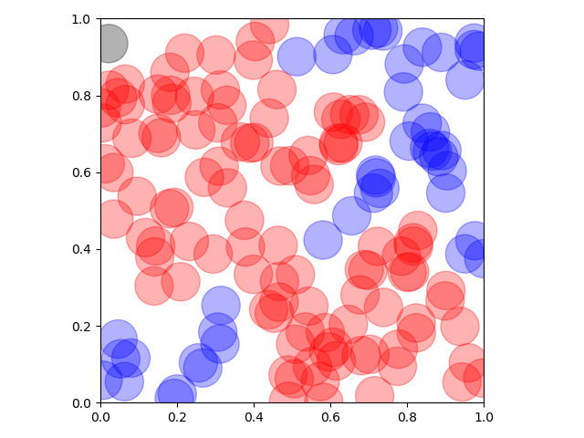
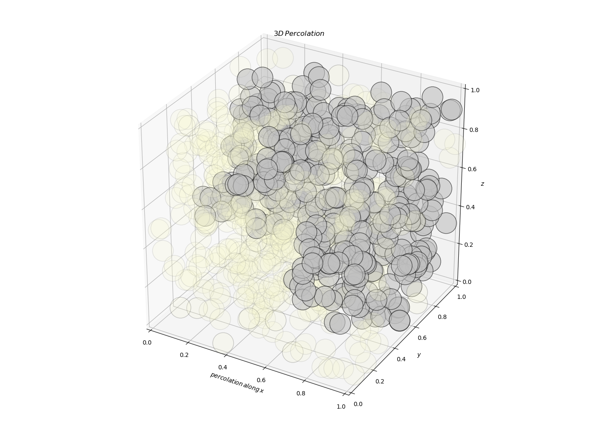

# Percolation-Modelling

Percolation theory describes the physics and mathematics of long-range connections in random systems and is applicable to a broad range of physics systems including conductivity, porosity, phase transitions, polymers, composite materials, and material strength. The approach can also be used to analyse diverse systems such as forest fires, disease epidemics, social networks and the Internet.

In this project I built a simple percolation model and use it to investigate the percolation threshold.

The project was carried out at Imperial College London as part of the 1st year Physics Undergraduate Computing Course (2013-2014).

